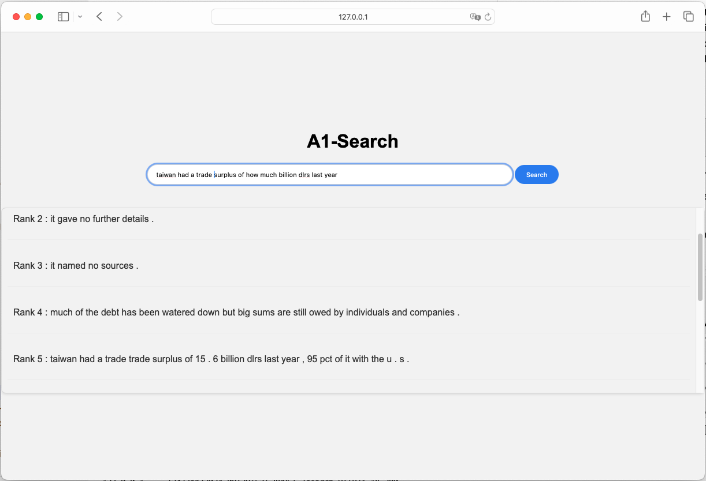

# A1-Search Engine
A robust search engine utilizing word embedding models to deliver context-aware search results, enhancing information retrieval.

## Table of Contents
- [Overview](#overview)
- [Task 1 Preparation and Training](#task-1-preparation-and-training)
  - [Foundational Research Papers](#11-foundational-research-papers)
  - [Word Embedding Models](#12-word-embedding-models)
  - [Data Source Acknowledgment](#13-data-source-acknowledgment)
  - [Technical Components](#14-technical-components)
  - [Getting Started](#15-getting-started)
- [Task 2 Model Comparison and Analysis](#task-2-model-comparison-and-analysis)
- [Task 3 Search Engine - Web Application Development](#task-3-search-engine---web-application-development)
- [Application & Use-Cases](#application--use-cases)
- [Contributing](#contributing)
- [Support](#support)
- [License](#license)
- [Acknowledgments](#acknowledgments)


## Overview
The Search Engine Project is an application of information retrieval in natural language processing (NLP), focusing on building a search engine that operates over word embedding model, alongside a user-friendly web interface. The project is designed to return the top paragraphs/docs with the highest similarity to a given query.

This project encompasses several key tasks, including preparation and training of word embedding models, model comparison and analysis, and the development of a web-based search engine.

## Task 1 Preparation and Training

### 1.1. Foundational Research Papers
The word embedding models in this repository are grounded in the insights and methodologies from the following research papers:

1. **Efficient Estimation of Word Representations in Vector Space**: This paper introduces innovative techniques for training high-quality word vectors and showcases the effectiveness of the skip-gram model. [Read the paper here](https://arxiv.org/pdf/1301.3781.pdf)

2. **GloVe: Global Vectors for Word Representation**: This paper presents the GloVe model, an unsupervised learning algorithm for generating word embeddings by aggregating global word-word co-occurrence statistics. [Read the paper here](https://aclanthology.org/D14-1162.pdf)

The implementation of the models in this repository closely adheres to the methodologies and insights presented in these papers, ensuring a robust and scientifically grounded approach to word embedding.

### 1.2. Word Embedding Models

1.2.1. **Word2Vec (Skip-gram Architecture)**
   - **File**: `Task-1-Word2Vec (Skipgram).ipynb`
   - **Description**: A robust model that utilizes the skip-gram architecture to generate word embeddings, effectively capturing the context of words within a specified window in a corpus.

1.2.2. **Word2Vec with Negative Sampling (Skip-gram Architecture)**
   - **File**: `Task-1-Word2Vec (Skipgram)-with-neg-sampling.ipynb`
   - **Description**: An enhancement of the basic Word2Vec model, incorporating negative sampling to improve computational efficiency and model performance, especially with large datasets.

1.2.3. **GloVe (Global Vectors for Word Representation)**
   - **File**: `Task-1-GloVe-from-Scratch.ipynb`
   - **Description**: An innovative model that constructs word embeddings by analyzing word-word co-occurrence statistics across the entire corpus, striking a balance between the intricacies of global statistics and local context.

### 1.3. Data Source Acknowledgment

#### Reuters Dataset
This project leverages the Reuters-21578 Text Categorization Collection available through the NLTK (Natural Language Toolkit) library. The Reuters dataset is a comprehensive collection of news stories categorized into different topics, serving as an excellent resource for supervised learning tasks in Natural Language Processing (NLP).

We extend our gratitude to the creators and maintainers of the Reuters dataset and the NLTK library for making this valuable resource accessible to the community. The dataset's rich content significantly enhances the Word2Vec model's training, enabling a more nuanced understanding of language semantics and context in our search engine.

**Source Details:**
- **Dataset Name**: Reuters-21578 Text Categorization Collection
- **Provided By**: NLTK (Natural Language Toolkit)
- **Dataset Description**: A collection of categorized news stories, ideal for text classification and topic modeling.
- **License**: Public Domain (Users are requested to cite the source)
- **Source Link**: [NLTK Data](http://www.nltk.org/nltk_data/)

### 1.4. Technical Components
- **[PyTorch](https://pytorch.org/)**: Used for building and training the Word2Vec model.
- **[NLTK](https://www.nltk.org/)**: Utilized for natural language processing tasks like tokenization, POS tagging, and accessing the Reuters dataset.
- **[Flask](https://flask.palletsprojects.com/en/2.0.x/)**: Serves the backend application and handles API requests.
- **[HTML/CSS/JavaScript](https://developer.mozilla.org/en-US/docs/Web/HTML)**: Used for building the frontend interface.

### 1.5. Getting Started

#### Prerequisites
- Python 3.6 or higher
- PyTorch
- Flask
- NLTK
- scipy

#### Installation
1. Clone the repository:
   ```sh
   git clone https://github.com/shaficse/A1--Search-Engine.git
   ```
2. Install the required Python packages:
   ```sh
   pip install -r all_requirements.txt
   ```

## Task-2 Model Comparison and Analysis

The models were trained on a selected subset of the Reuters corpus from NLTK, containing 500 passages out of a total of 54,716, and 2677 tokens out of 1720917. The training performance was assessed based on the average training loss and the total time taken for training

### 2.1. Training Loss & Time

This section compares the Skip-gram, Skip-gram with Negative Sampling, and GloVe models based on their training loss and training time, providing insights into the trade-offs between these models in terms of their learning efficiency and computational requirements.

#### Training Loss
| Model                          | Average Training Loss |
|--------------------------------|-----------------------|
| Skip-gram                      | 8.133966            |
| Skip-gram with Negative Sampling | 1.977957             |
| GloVe Scratch                        | 0.724803 |

#### Training Time

| Model                          | Total Training Time |
|--------------------------------|---------------------|
| Skip-gram                      | 18m 4s            |
| Skip-gram with Negative Sampling | 17m 8s             |
| GloVe Scratch                    | 1m 54s              |


- **Training Loss:**
- Skip-gram: Exhibited an average training loss of 8.133966, indicating room for optimization.
- Skip-gram with Negative Sampling: Showed improved efficiency with a lower average training loss of 1.977957.
- GloVe Scratch: Achieved the lowest training loss of 0.724803, indicating a more effective learning during training.

- **Training Time:**
- Skip-gram: Took 18 minutes and 4 seconds for training.
- Skip-gram with Negative Sampling: Required 17 minutes and 8 seconds, slightly faster than Skip-gram.
- GloVe Scratch: Was significantly faster with a training time of 1 minute and 54 seconds.

This comparison helps in understanding the trade-offs between different word embedding models in terms of their learning efficiency and computational requirements.

### 2.2. Model's Accuracy on Analogy Dataset

The comparison of Skip-gram, Skip-gram with Negative Sampling, custom GloVe, and pre-trained GloVe models on the   `capital-common-countries (semantic)` and `past-tense (syntactic)` [analogy dataset](https://www.fit.vutbr.cz/~imikolov/rnnlm/word-test.v1.txt) reveals significant insights:
| Model                             | Window Size | Training Loss(taken from Traning Notebooks) | Syntactic Accuracy | Semantic Accuracy |
|-----------------------------------|-------------|---------------|--------------------|-------------------|
| Skip-gram                         | 2           | 8.133966         | 0.00%              | 0.00%             |
| Skip-gram with Negative Sampling  | 2           | 1.977957       | 0.00%              | 0.00%             |
| GloVe (Custom)                    | 2           | 0.724803        | 0.00%              | 0.00%             |
| GloVe (Pre-trained Gensim)        | N/A         | N/A           | 53.40%             | 54.97%            |


- **Custom Models' Zero Accuracy:**
Skip-gram, Skip-gram with Negative Sampling,and Scratch GloVe models demonstrated zero accuracy, likely due to the **out-of-vocabulary issue**.

- **Strong Performance of Pre-trained GloVe:**
The pre-trained GloVe model exhibited strong performance, with over 50% accuracy in both tasks, underscoring the value of extensive training on diverse datasets.

- **Importance of Rich Training Data:**
The results highlight the importance of a rich training corpus and sophisticated preprocessing to capture nuanced language relationships effectively.

In conclusion, the custom models (Skip-gram, Skip-gram with Negative Sampling, and GloVe Scratch) did not perform well in this aspect, with both semantic and syntactic accuracies at 0.00%, indicating issues like inadequate training data or out-of-vocabulary words.


### 2.3. Spearman's Rank Correlation Summary
The Spearman's rank correlation analysis reveals varied performance among different word embedding models in aligning with human-perceived word similarities on [wordsim353_sim_rel data](http://alfonseca.org/eng/research/wordsim353.html).

| Model                     | Spearman's Rank Correlation |
|---------------------------|-----------------------------|
| Skipgram                  |  0.105                       |
| Skipgram-Neg-Sampling     | -0.118                     |
| GloVe Scratch             | -0.224                     |
| GloVe Gensim              | 0.491                       |


- Skipgram: Achieved a correlation of 0.105, indicating a weak positive relationship between the model's similarity scores and human judgment.

- Skipgram-Neg-Sampling: Registered a correlation of -0.118, suggesting a weak inverse relationship, indicating that the model's assessment of similarity tends to slightly oppose human judgment.

- GloVe Scratch: Had a correlation of -0.224, demonstrating a somewhat stronger inverse relationship than the Skipgram-Neg-Sampling model, suggesting its assessments are more contrary to human judgment.

- GloVe Gensim: Scored the highest with a correlation of 0.491, signifying a moderate positive correlation with human judgment, making it relatively the most aligned model with human perception among those evaluated.

The pre-trained GloVe model from Gensim showcases superior performance, significantly aligning with human judgment in word similarities.


- Future research directions may include enhancing custom-trained models by:
   - Expanding the training corpus to expose the model to a more varied language.

   - Optimizing model architectures/ tuning the parameters to improve their learning capacity.
Refining training processes to ensure more effective learning.

The details of the Comparision and Analysis are experiemented on this notebook `Task-2-Model-Comparison-Analysis.ipynb`.

## Task-3 Search Engine - Web Application Development

This Task introduces a web application designed to simplify the retrieval of information from a text corpus. Users can input search queries into a streamlined interface, which then utilizes one of our trained word embedding model to compute the similarity between the query and the corpus by computing the dot product between them. 

- **Model Selection**: 
Implement a function to compute the dot product between an input query and a corpus, retrieving the top 10 most similar passages with a focus on semantic similarity. it's crucial to choose the right model.

   - Skip-gram:
      - Training Loss/Time: High (8.133966)/Long (18m 4s)
      - Spearman's Rank Correlation: Weak positive (0.105)

      Note: Despite inefficiency in training, shows a slight alignment with human judgment of word similarity.

   - Skip-gram with Negative Sampling:

      - Training Loss/Time: Medium (1.977957)/Moderate (17m 8s)
      - Spearman's Rank Correlation: Weak negative (-0.118)

      Note: More efficient than Skip-gram but tends to slightly oppose human judgment.

   - GloVe Scratch:
      - Training Loss/Time: Low (0.724803)/Short (1m 54s)
      - Spearman's Rank Correlation: Negative (-0.224)
      
      Note: Most efficient in training but significantly opposes human judgment of similarity.

   Based on the priority of semantic similarity in the task and considering Spearman's rank correlation, Skip-gram is recommended. Despite its longer training time and higher loss, its weak positive correlation with human judgment of word similarity suggests it may align slightly better with human semantic understanding.

- **Application Development**: For the development of this application, we utilized Flask, a lightweight and flexible micro web framework. Flask's simplicity and extensibility make it an ideal choice for building efficient, scalable web applications.

- **Launching the Application**:
   1. Start the Flask server:
      ```sh
      python app.py
      ```
   2. Open your web browser and navigate to [http://127.0.0.1:5000](http://127.0.0.1:5000).

   3. Enter a search query in the input box and click the "Search" button/ press 'Enter' from keyboard.

   4. View the ranked list of sentences that are most similar to your query.

   

   For example in the above Screenshot-  The presence of other less relevant passages in the top results highlights the need for improved precision in the model's information retrieval capabilities.

   For Live Demo from Huggingface Space [A1-Search](https://huggingface.co/spaces/shaficse/a1-search)


## Contributing
We welcome contributions! Please see our [CONTRIBUTING.md](CONTRIBUTING.md)
 for how you can contribute to this project.

## Support
If you encounter any issues or have any questions, please feel free to reach out by opening an issue in the repository.

## License
This project is licensed under the MIT License. See the [LICENSE](LICENSE) file for more details.

## Acknowledgments
- The authors and contributors of the foundational research papers.
- The creators and maintainers of the Reuters dataset and the NLTK library.
